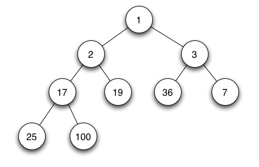

## Heap

### what is it

a binary tree where the smallest value is always on the top. used to implement a ***priority queue** or **heap sort**

### costs

<table border="2" cellspacing="0" cellpadding="6" rules="groups" frame="hsides">

<colgroup>
<col  class="org-left" />

<col  class="org-left" />

<col  class="org-left" />
</colgroup>
<thead>
<tr>
<th scope="col" class="org-left">Heap</th>
<th scope="col" class="org-left">avarage</th>
<th scope="col" class="org-left">worst</th>
</tr>
</thead>

<tbody>
<tr>
<td class="org-left">Get Min</td>
<td class="org-left">O(1)</td>
<td class="org-left">O(1)</td>
</tr>

<tr>
<td class="org-left">Remove Min</td>
<td class="org-left">O(log(n))</td>
<td class="org-left">O(log(n))</td>
</tr>

<tr>
<td class="org-left">Insertion</td>
<td class="org-left">O(1)</td>
<td class="org-left">O(log(n))</td>
</tr>

<tr>
<td class="org-left">Heapsort</td>
<td class="org-left">O(1)</td>
<td class="org-left">O(n*log(n))</td>
</tr>

<tr>
<td class="org-left">Heapify</td>
<td class="org-left">O(n)</td>
<td class="org-left">O(n)</td>
</tr>
</tbody>

<tbody>
<tr>
<td class="org-left">Space</td>
<td class="org-left">O(n)</td>
<td class="org-left">O(n)</td>
</tr>
</tbody>
</table>

### operations

insertion

- [pseudo code](insertion/pseudo.c)
- [C code](insertion/c-code.c)
- [C++ class](insertion/cpp-class.cpp)

search

- [pseudo code](search/pseudo.c)
- [C code](search/c-code.c)
- [C++ class](search/cpp-class.cpp)

deletion

- [pseudo code](deletion/pseudo.c)
- [C code](deletion/c-code.c)
- [C++ class](deletion/cpp-class.cpp)

inorder traversal

- [pseudo code](inorder-traversal/pseudo.c)
- [C code](inorder-traversal/c-code.c)
- [C++ class](inorder-traversal/cpp-class.cpp)

Inorder traversal can be used to **sort** the binary tree

preorder traversal

- [pseudo code](preorder-traversal/pseudo.c)
- [C code](preorder-traversal/c-code.c)
- [C++ class](preorder-traversal/cpp-class.cpp)

preorder Traversal can be used to **copy** the binary tree

postorder traversal

- [pseudo code](postorder-traversal/pseudo.c)
- [C code](postorder-traversal/c-code.c)
- [C++ class](postorder-traversal/cpp-class.cpp)

postorder Traversal can be used to **delete** the binary tree

get minimum (recursive)

- [pseudo code](get-minimum-recursive/pseudo.c)
- [C code](get-minimum-recursive/c-code.c)
- [C++ class](get-minimum-recursive/cpp-class.cpp)

get minimum (iterative)

- [pseudo code](get-minimum-iterative/pseudo.c)
- [C code](get-minimum-iterative/c-code.c)
- [C++ class](get-minimum-iterative/cpp-class.cpp)

    

get maximum (recursive)

- [pseudo code](get-maximum-recursive/pseudo.c)
- [C code](get-maximum-recursive/c-code.c)
- [C++ class](get-maximum-recursive/cpp-class.cpp)

    

get maximum (iterative)

- [pseudo code](get-maximum-iterative/pseudo.c)
- [C code](get-maximum-iterative/c-code.c)
- [C++ class](get-maximum-iterative/cpp-class.cpp)

    
### complete implementation
- [C implementation](complete-implementation/c-code.c)
- [C++ implementation](complete-implementation/cpp-class.cpp)
- [All Pseudo Codes](complete-implementation/all-pseudo-code.md)
### pros
### cons
### use cases
